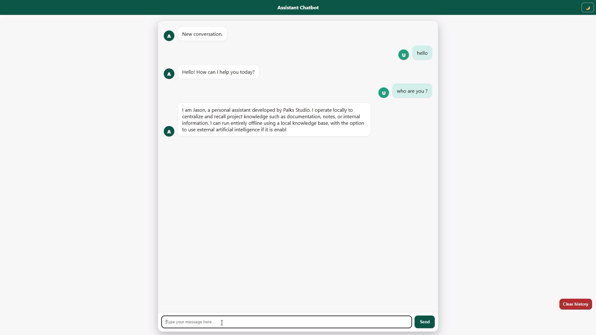

<p align="center">
  
</p>

> 🇬🇧 English | [🇫🇷 Français](./README_FR.md)


[](https://palks-studio.com/en/flask-chatbot)

<p align="center">
  <a href="https://palks-studio.com">
    
  </a>
</p>

# Advanced Flask Chatbot — Version 2.0

> This repository is a technical presentation and documentation repository.  
> It does not contain downloadable source code or production files.

A complete project to build your own **Flask-based conversational assistant**, ready to run:  

- **locally (localhost)**  
- **on shared hosting such as o2switch (Passenger / cPanel)**

No external database, no hidden dependencies. You can use it as-is, modify it, or integrate it into another website or API.

---

## Overview

This project provides a self-hosted conversational assistant built with Flask,  
designed for developers and teams who want full control over their chatbot’s behavior and deployment.

The architecture prioritizes:  

- a local knowledge base (JSON) as the primary source  
- predictable behavior in professional environments  
- optional AI integration (OpenAI)  
- simple deployment without dependency on external SaaS platforms

---

## Project Structure

```
flask_chatbot_advanced_2.0/
│
├── app.py                      → Flask entry point (server + API routes)
├── main.py                     → Bot logic: responses (OpenAI + local JSON)
├── storage.py                  → SQLite-based conversation history (save & read)
│
├── passenger_wsgi.py           → For hosting on o2switch / Passenger
├── requirements.txt            → Python dependencies (Flask, CORS, SQLite, OpenAI...)
├── .env.example                → Template for the user (“fill in your API key here”)
│                                 # ⚠ The .env file is NOT included (user must create it to use OpenAI)
│                                 # ⚠ The data.db file is not provided (created automatically on first run)
│
├── Dockerfile                  → Dockerfile → (optional) Docker container
├── docker-compose.yml          → docker-compose.yml → (optional) Simplified Docker launch
│
├── LICENSE.md                  → Terms of use and legal framework
│
├── install.bat                 → Windows installation script (pip install + launch)
├── install.sh                  → Linux/Mac script (chmod + pip install)
│
├── sample_data/
│   └── sample_data.json        → Local content database (FAQ, simple answers)
│
├── templates/
│   ├── index.html              → User interface (chatbot frontend)
│   └── widget.html             → New floating interface
│
├── static/
│   ├── widget.js               → Script to open/close the floating widget
│   └── widget.css              → Style for the floating widget (button + mini-window)
│
├── logs/
│   └── errors.log              → Automatically created on error
│
└── docs/
    ├── README_TECHNIQUE.md     → Technical documentation and internal architecture
    ├── README.md               → Main project documentation and guides
    ├── CUSTOMISATION.md        → Bot customization (design, responses, OpenAI…)
    └── INSTALL.md              → Complete user guide
```


---

## Key Features

- **Compatible with o2switch / Passenger (shared hosting)**  
- **No database required** (JSON-based operation)  
- **Readable, well-commented and easily customizable code**  
- **CORS enabled:** usable with websites or frontend interfaces  
- **Integrated logging system:** errors automatically recorded in `/logs/`

---

## Typical Use Cases

This chatbot is designed for:  

- internal knowledge assistants  
- support or documentation automation  
- self-hosted AI assistants  
- internal tools requiring controlled responses  
- websites embedding a chatbot widget

The system can operate fully offline using a local knowledge base,  
or optionally use OpenAI when extended responses are required.

---

## Automatically Generated Files

When the chatbot is launched for the first time, some files are created automatically:  

| File              | Purpose |
|-------------------|---------|
| `data.db`         | SQLite database storing conversations (if `ENABLE_PERSISTENCE=true`) |
| `logs/errors.log` | Created only when a server error occurs |
| `.env`            | Must be created from `.env.example` to enable OpenAI |

---

## Operating Modes

| Mode | Description | Requires OpenAI Key |
|------|-------------|---------------------|
| **Local JSON** (default) | Responses generated from the local knowledge base | No |
| **OpenAI GPT (optional)** | Uses OpenAI API when a key is provided | Yes |

The mode is automatically selected depending on the presence of the `OPENAI_API_KEY` variable in `.env`.  
No tokens are consumed if no key is provided.

---

## Error Logs

The `logs/` directory automatically records Flask server errors:  

- automatic creation of `logs/errors.log` when an error occurs  
- automatic creation of the `logs/` directory if missing  
- recording of date, error message and full traceback

This system works:  

- in local mode  
- with or without OpenAI  
- in production (Passenger / shared hosting)

---

**Palks Studio — Version 2.0 (Advanced Edition)**  
Compatible with Python 3.12+ and Flask 3.0+

© Palks Studio — see LICENSE.md  
- https://palks-studio.com
