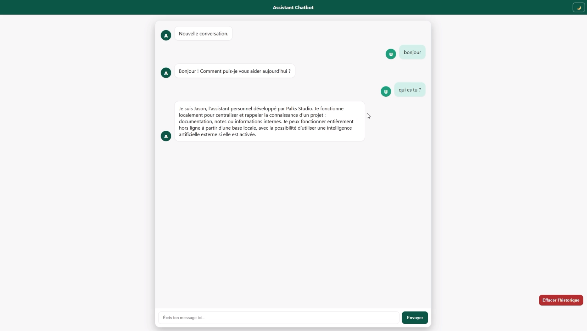

<p align="center">
  
</p>

> 🇫🇷 Français | [🇬🇧 English](./README.md)


[](https://palks-studio.com/fr/chatbot-flask)

<p align="center">
  <a href="https://palks-studio.com">
    
  </a>
</p>

# Chatbot Flask Avance — Version 2.0

> Ce dépôt constitue une présentation technique et une documentation du projet.  
> Il ne contient pas de code source téléchargeable ni de fichiers de production.

Un projet complet pour créer ton propre **assistant conversationnel avec Flask**, prêt à être utilisé :  

- **en local (localhost)**  
- **sur un hébergement mutualisé comme o2switch (Passenger / cPanel)**

Aucune base externe, aucune dépendance cachée. Tu peux l’utiliser tel quel, le modifier ou l’intégrer dans un autre site ou une API.

[](https://palks-studio.com/fr/chatbot-flask)

---

## Vue d’ensemble

Ce projet propose un assistant conversationnel auto-hébergé, structuré et basé sur Flask,  
conçu pour les développeurs et les équipes souhaitant garder un contrôle total sur  
le comportement et le déploiement de leur chatbot.

L’architecture privilégie :  

- une base de connaissances locale (JSON) prioritaire  
- un comportement prévisible en environnement professionnel  
- une intégration IA optionnelle (OpenAI)  
- un déploiement simple, sans dépendance à une plateforme SaaS externe

---

## Structure du projet

```
chatbot_flask_avance_2.0/
│
├── app.py                      → Point d’entrée Flask (serveur + routes API)
├── main.py                     → Logique du bot : réponses (OpenAI + JSON local)
├── storage.py                  → Gestion SQLite (sauvegarde & lecture de l’historique)
│
├── passenger_wsgi.py           → Pour hébergement sur o2switch / Passenger
├── requirements.txt            → Dépendances Python (Flask, CORS, SQLite, OpenAI...)
├── .env.example                → Modèle pour l’utilisateur (“remplir sa clé API ici”)
│                                 # ⚠ Le fichier `.env` n’est PAS inclus (l’utilisateur doit le créer s’il veut utiliser OpenAI)
│                                 # ⚠ Le fichier `data.db` n’est pas fourni (il se crée automatiquement au premier lancement)
│
├── Dockerfile                  → (optionnel) Conteneur Docker
├── docker-compose.yml          → (optionnel) Lancement Docker simplifié
│
├── LICENCE.md                  → Conditions d’utilisation et cadre légal
│
├── install.bat                 → Script d’installation Windows (pip install + launch)
├── install.sh                  → Script Linux/Mac (chmod + pip install)
│
├── sample_data/
│   └── sample_data.json        → Base de contenus locale (FAQ, réponses simples)
│
├── templates/
│   ├── index.html              → Interface utilisateur (frontend du chatbot)
│   └── widget.html             → Nouvelle interface flottante
│
│── static/
│   ├── widget.js               → Script d’ouverture/fermeture du widget flottant
│   └── widget.css              → Style dédié au widget flottant (bouton + mini-fenêtre)
│
├── logs/
│   └── errors.log              → Se crée automatiquement si erreur
│
└── docs/
    ├── INSTALL.md              → Guide utilisateur complet
    ├── README_TECHNIQUE.md     → Documentation principale du projet
    ├── README.md               → Documentation et guides du projet
    └── CUSTOMISATION.md        → Personnalisation du bot (design, réponses, OpenAI…)
```


---

## Points forts

- **Compatible o2switch / Passenger (hébergement mutualisé)**  
- **Aucune base de données requise** (fichier JSON seulement)  
- **Code lisible, commenté, facilement personnalisable**  
- **CORS activé : utilisable avec un site web ou une interface front-end**  
- **Système de logs intégré :** erreurs enregistrées automatiquement dans le dossier `/logs/`

---

## Cas d’usage typiques

Ce chatbot est conçu pour :  

- assistants internes de connaissances  
- automatisation de support ou de documentation  
- assistants IA auto-hébergés  
- outils internes nécessitant des réponses contrôlées  
- sites web intégrant un widget conversationnel

Le système peut fonctionner entièrement hors ligne à partir d’une base de connaissances locale,  
ou utiliser OpenAI de manière optionnelle lorsque des réponses étendues sont nécessaires.

---

## Fichiers générés automatiquement

Lorsque le chatbot est lancé pour la première fois, certains fichiers sont créés automatiquement :  

| Fichier           | Rôle                                            |
|-------------------|-------------------------------------------------|
| `data.db`         | Base SQLite enregistrant les conversations (si `ENABLE_PERSISTENCE=true`) |
| `logs/errors.log` | Créé uniquement en cas d’erreur serveur |
| `.env`            | À créer à partir de `.env.example` pour activer OpenAI |

---

## Modes de fonctionnement

| Mode         | Description                                              | Nécessite une clé OpenAI |
|--------------|----------------------------------------------------------|---------------------------|
| **Local JSON** (par défaut) | Réponses générées depuis la base locale | Non |
| **OpenAI GPT (optionnel)**  | Utilisation de l’API OpenAI si une clé est fournie | Oui |

Le choix se fait automatiquement selon la présence de la variable `OPENAI_API_KEY` dans `.env`.  
Aucune consommation de tokens si aucune clé n'est renseignée.

---

## Journaux d’erreurs (Logs)

Le dossier `logs/` permet d’enregistrer automatiquement les erreurs du serveur Flask :

- création automatique du fichier `logs/errors.log` en cas d’erreur
- génération automatique du dossier `logs/` si nécessaire
- enregistrement de la date, du message et de la trace complète (`traceback`)

Ce système fonctionne :

- en mode local  
- avec ou sans OpenAI  
- en production (Passenger / hébergement mutualisé)

---

**Palks Studio — Version 2.0 (Édition Avancée)**  
Compatible avec Python 3.12+ et Flask 3.0+

© Palks Studio — voir LICENSE.md  
- https://palks-studio.com
